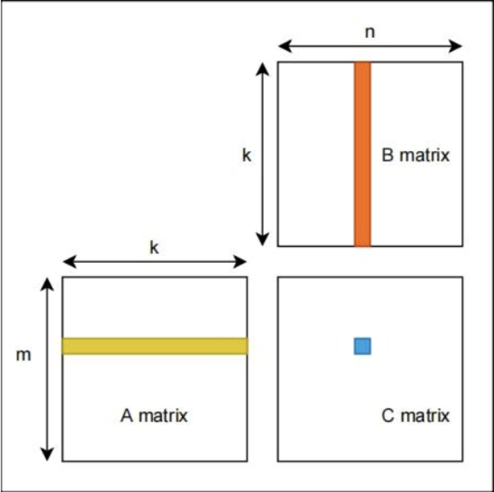
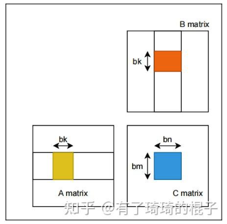
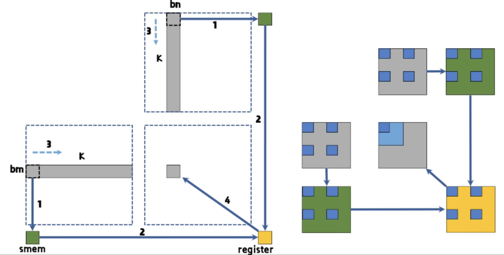
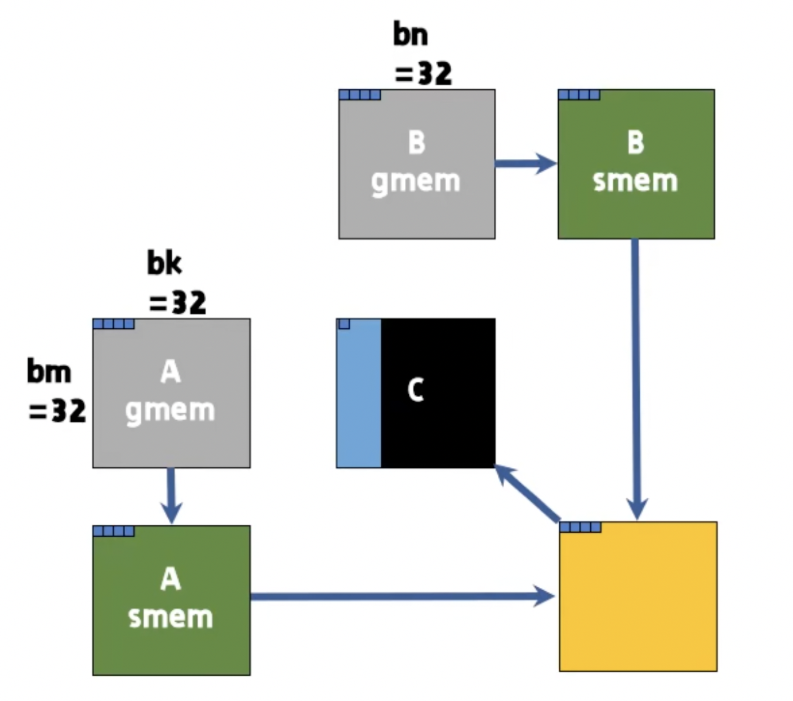
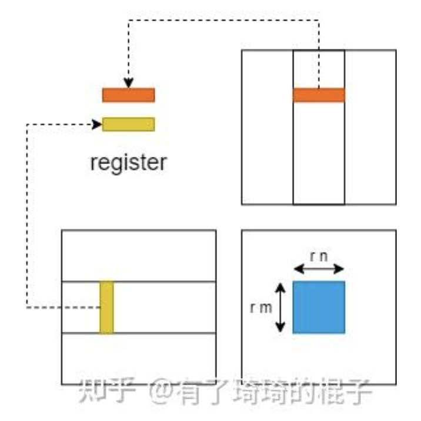

# Note on CUDA programming

## Table of Contents
1. [CUDA Reduction Kernel](#cuda-reduction-kernel)
    - [Baseline](#baseline)
    - [No Divergence Branch](#no-divergence-branch)
    - [No Bank Conflict](#no-bank-conflict)
    - [Add During Load](#add-during-load)
    - [Unroll Last Warp](#unroll-last-warp)
    - [Shuffle](#shuffle)

2. [SGEMM](#sgemm)
    - [Baseline](#baseline)
    - [Shared Memory](#shared-memory)
    - [Increase Work Per Thread](#increase-work-per-thread)
    - [Using Float4](#using-float4)
    - [Register Outer Product](#register-outer-product)
## CUDA Reduction Kernel

The CUDA kernel performs a parallel reduction operation to compute the sum of elements in an input array. Each block processes a section of the input array, computes the sum of its elements, and writes the result to an output array.

**Input**: an array of length N.

**Config**: M: split the array into M portions, or the number of blocks. (N is divisible by M.)


**Output**: an array of length M.

1. **Data Loading (baseline)**:

    ```cuda
    // Find the start of this block's data in the global array
    float *input_begin = d_input + blockDim.x * blockIdx.x;
    // Initialize shared memory for this block
    __shared__ float input_shared[THREAD_PER_BLOCK];
    // Threadwisely load data from global memory to shared memory
    input_shared[threadIdx.x] = input_begin[threadIdx.x];
    __syncthreads(); // Ensure all threads have written their data to shared memory
    ```

2. **Parallel Reduction:**

    we will compare several optimization strategies below.

    - Baseline
    - No divergence branch
    - No bank conflict
    - Add during Load
    - Unroll last warp
    - Shuffle

3. **Output**:

    ```cuda
    // Only the first thread in each block writes the final sum to the output array
    if (threadIdx.x == 0)
        d_output[blockIdx.x] = input_shared[0];
    ```

### Baseline
1. **Algorithm**

    `D = blockDim = THREAD_PER_BlOCK= N/M`
    
    - **Step size 1**: `threadIdx.x` = 0, 2, 4, 6, ..., D-2,

        ```
        input_shared[threadIdx.x] += input_shared[threadIdx.x + 1];
        __syncthreads();
        ```
    - **Step size 2**: `threadIdx.x` = 0, 4, 8, 12,..., D-4,

        ```
        input_shared[threadIdx.x] += input_shared[threadIdx.x + 2];
        __syncthreads();
        ```
    - **Step size k**: `threadIdx.x` = 0, 2k, 4k, 6k,..., D-2k,

        ```
        input_shared[threadIdx.x] += input_shared[threadIdx.x + k];
        __syncthreads();
        ```
    - **Step size D/2**: `threadIdx.x` = 0,

        ```
        input_shared[threadIdx.x] += input_shared[threadIdx.x + D/2];
        __syncthreads();
        ```

    
1. **Reduce a subarray of length 8 (Visualization)**:

    D = 8:

    - **Initial State**: Each thread loads one element into shared memory.
        ```
        input_shared: [a0, a1, a2, a3, a4, a5, a6, a7]
        ```

    - **Step size 1**: Threads 0, 2, 4, 6 add elements at offset 1 (e.g., thread 0 adds a1 to a0).
        ```
        input_shared: [a0+a1, a1, a2+a3, a3, a4+a5, a5, a6+a7, a7]
        ```

    - **Step size 2**: Threads 0, 4 add elements at offset 2 (e.g., thread 0 adds a2+a3 to a0+a1).
        ```
        input_shared: [a0+a1+a2+a3, a1, a2+a3, a3, a4+a5+a6+a7, a5, a6+a7, a7]
        ```

    - **Step size 4**: Thread 0 adds the element at offset 4 (a4+a5+a6+a7).
        ```
        input_shared: [a0+a1+a2+a3+a4+a5+a6+a7, a1, a2+a3, a3, a4+a5+a6+a7, a5, a6+a7, a7]
        ```

2. **Key Code**:

    ```cuda
    // double the step size i for each iteration
    for (int i = 1; i < blockDim.x; i *= 2)
    {   
        //threads with indices that are multiples of 2*i (where 
        //i is the current step size) add the value from the 
        //shared memory location at offset i to their own.
        if (threadIdx.x % (i * 2) == 0)
        {
            input_shared[threadIdx.x] += input_shared[threadIdx.x + i];
        }
        __syncthreads();
    }
    ```


### No Divergence Branch
Assign work to threads based on a stride that aligns with warp boundaries, ensuring all threads in a warp perform similar operations.
1. **Algorithm**

    `D = blockDim = THREAD_PER_BlOCK= N/M`
    
    - **Step size 1**: `threadIdx.x` = 0, 1, 2, 3, ..., D/2 - 1,

        ```
        input_shared[2 * threadIdx.x] += input_shared[2 * threadIdx.x + 1];
        __syncthreads();
        ```
    - **Step size 2**: `threadIdx.x` = 0, 1, 2, 3,..., D/4 - 1,

        ```
        input_shared[4 * threadIdx.x] += input_shared[4 * threadIdx.x + 2];
        __syncthreads();
        ```
    - **Step size k**: `threadIdx.x` = 0, 1, 2, 3,..., D/(2*k) - 1,

        ```
        input_shared[2*k * threadIdx.x] += input_shared[2*k *threadIdx.x + k];
        __syncthreads();
        ```
    - **Step size D/2**: `threadIdx.x` = 0,

        ```
        input_shared[D * threadIdx.x] += input_shared[D * threadIdx.x + D/2];
        __syncthreads();
        ```

    
1. **Reduce a subarray of length 8 (Visualization)**:
    
    D = 8:

    - **Initial state**: Each thread loads one element into shared memory.
        ```
        input_shared: [a0, a1, a2, a3, a4, a5, a6, a7]
        ```

    - **Step size 1**: Threads 0, 1, 2, 3 add elements at indices `threadIdx.x * 2 and threadIdx.x * 2 + 1` (e.g., thread 0 adds a1 to a0, thread 1 adds a3 to a2).
        ```
        input_shared: [a0+a1, a1, a2+a3, a3, a4+a5, a5, a6+a7, a7]
        ```

    - **Step size 2**: Threads 0, 1 add elements at indices `threadIdx.x * 4` and `threadIdx.x * 4 + 2` (e.g., thread 0 adds a2+a3 to a0+a1).
        ```
        input_shared: [a0+a1+a2+a3, a1, a2+a3, a3, a4+a5+a6+a7, a5, a6+a7, a7]
        ```

    - **Step size 4**: Thread 0 adds elements at indices `threadIdx.x * 8` and `threadIdx.x * 8 + 4` (i.e., a4+a5+a6+a7 to a0+a1+a2+a3).
        ```
        input_shared: [a0+a1+a2+a3+a4+a5+a6+a7, a1, a2+a3, a3, a4+a5+a6+a7, a5, a6+a7, a7]
        ```

2. **Key Code**:

    ```cuda
    // double the step size i for each iteration
    // On each step, threads with indices less than blockDim.x/(2*i) add the value 
    // at index threadIdx.x*2*i to the value at threadIdx.x*2*i + i
    for (int i = 1; i < blockDim.x; i *= 2)
    {
        if (threadIdx.x <  blockDim.x / (i * 2))
        {   
            int index = threadIdx.x * 2 * i;
            input_shared[index] += input_shared[index + i];
        }
        __syncthreads(); // Synchronize to make sure all threads are done before the next step
    }
    ```
3. **Discussions**:
    - **Thread Utilization**:
    Comparing to the baseline, for each iteration, only the first `blockDim.x/(2*i)` threads are active, utilizing a contiguous block of threads. This reduces thread divergence within warps, as active threads are grouped together, improving warp execution efficiency.
    - **Bank Conflicts**:
    Let us assume `THREAD_PER_BLOCK` is large:
        1. `i = 1`:
            - **Active Threads**: `threadIdx.x < 64 / (2 * 1) = 32` (threads 0 to 31). 
            -  `index = threadIdx.x * 2 * 1 = 2 * threadIdx.x`
            - Thread 0: Accesses `input_shared[0]` (bank 0) and `input_shared[1]` (bank 1).
            - Thread 16: Accesses `input_shared[32]` (bank 0) and `input_shared[33]` (bank 1).
            - Thread N and Thread N+16 have conflict.
        2. `i = 2`:
            - **Active Threads**: `threadIdx.x < 64 / (2 * 2) = 16` (threads 0 to 31). 
            -  `index = threadIdx.x * 2 * 2 = 4 * threadIdx.x`
            - Threads N, N+8, N+16, N+32 have conflicts.
        3. `i = 2^k`, `i <= 16`: 
            - Threads `{N+ n (16/i) | n = 0,1, ...(2i-1)}`  have conflicts.
        4.  `i>=16`:
            - All threads have bank conflicts between each other. 

### No Bank Conflict
To avoid bank conflict, it's better to ensure threads in a warp access consecutive addresses that map to different banks.
1. **Algorithm**

    `D = blockDim = THREAD_PER_BlOCK= N/M`
    
    - **Step size D/2**: `threadIdx.x` = 0, 1, 2, 3, ..., D/2 - 1,

        ```
        input_shared[threadIdx.x] += input_shared[threadIdx.x + D/2];
        __syncthreads();
        ```
    - **Step size D/4**: `threadIdx.x` = 0, 1, 2, 3,..., D/4 - 1,

        ```
        input_shared[threadIdx.x] += input_shared[threadIdx.x + D/4];
        __syncthreads();
        ```
    - **Step size k**: `threadIdx.x` = 0, 1, 2, 3,..., k - 1,

        ```
        input_shared[threadIdx.x] += input_shared[threadIdx.x + k];
        __syncthreads();
        ```
    - **Step size 1**: `threadIdx.x` = 0,

        ```
        input_shared[threadIdx.x] += input_shared[threadIdx.x + 1];
        __syncthreads();
        ```
1. **Reduce a subarray of length 8 (Visualization)**:
    
    With warp size 2, addresses 0, 2, 4, 6 are in bank 0, addresses 1,3,5,7 are in bank 1.

    - **Initial state**: Each thread loads one element into shared memory.
        ```
        input_shared: [a0, a1, a2, a3, a4, a5, a6, a7]
        ```

    - **Step size 4**: Threads 0, 1, 2, 3 add elements at indices `threadIdx.x and threadIdx.x + 4` (e.g., thread 0 adds a4 to a0, thread 1 adds a5 to a1).
        ```
        input_shared: [a0+a4, a1+a5, a2+a6, a3+a7, a4, a5, a6, a7]
        ```

    - **Step size 2**: Threads 0, 1 add elements at indices `threadIdx.x` and `threadIdx.x + 2` (e.g., thread 0 adds a0+a4 to a2+a6).
        ```
        input_shared: [a0+a4+a2+a6, a1+a5+a3+a7, a2+a6, a3+a7, a4, a5, a6, a7]
        ```

    - **Step size 1**: Thread 0 adds elements at indices `threadIdx.x ` and `threadIdx.x + 1` (i.e., a0+a4+a2+a6 to a1+a5+a3+a7).
        ```
        input_shared: [a0+a4+a2+a6+a1+a5+a3+a7, a1+a5+a3+a7, a2+a6, a3+a7, a4, a5, a6, a7]
        ```
2. **Key Code**:
    ```cuda
    // half the step size for each iteration
    // for each step size i, threads with indices less than i add the value 
    // at index threadIdx.x to the value at threadIdx.x + i
    for (int i = blockDim.x / 2; i > 0; i /= 2)
    {
        if (threadIdx.x < i)
        {   
            input_shared[threadIdx.x] += input_shared[threadIdx.x + i];
        }
        __syncthreads(); // Synchronize to make sure all threads are done before the next step
    }
    ```
3. **Discussion**:
    - When step size i >= 32, thread `threadIdx.x` access bank `threadIdx.x % 32`, ensuring threads within the same warp access distinct banks.
    - When step size i < 32, data is stored in addresses mapped to different banks, preventing bank conflicts.

### Add During Load
Each thread sums L elements from global memory before storing the result in shared memory

1. **Algorithm**
    Given fixed N and N, D is given by.

    `D = blockDim = THREAD_PER_BlOCK= N/(L*M)`

    - **Add During Load**: `threadIdx.x` = 0, 1, 2, 3, ..., D-1

        ```
        input_shared[threadIdx.x] += input_begin[threadIdx.x + 0];
        input_shared[threadIdx.x] += input_begin[threadIdx.x + D];
        input_shared[threadIdx.x] += input_begin[threadIdx.x + 2*D];
        input_shared[threadIdx.x] += input_begin[threadIdx.x + 3*D];
        ...
        input_shared[threadIdx.x] += input_begin[threadIdx.x + (L-1)*D];
        __syncthreads();
        ```
    
    - **Step size D/2**: `threadIdx.x` = 0, 1, 2, 3, ..., D/2 - 1,

        ```
        input_shared[threadIdx.x] += input_shared[threadIdx.x + D/2];
        __syncthreads();
        ```
    - **Step size D/4**: `threadIdx.x` = 0, 1, 2, 3,..., D/4 - 1,

        ```
        input_shared[threadIdx.x] += input_shared[threadIdx.x + D/4];
        __syncthreads();
        ```
    - **Step size k**: `threadIdx.x` = 0, 1, 2, 3,..., k - 1,

        ```
        input_shared[threadIdx.x] += input_shared[threadIdx.x + k];
        __syncthreads();
        ```
    - **Step size 1**: `threadIdx.x` = 0,

        ```
        input_shared[threadIdx.x] += input_shared[threadIdx.x + 1];
        __syncthreads();
        ```

1. **Reduce a subarray of length 8 (Visualization)**:

    L = 2, `THREAD_PER_BlOCK` is halved. 

    - **Initial state**: Starting from an array in global memory:
        ```
        input_begin: [a0, a1, a2, a3, a4, a5, a6, a7]
        ```
    
    - **Add during load**: Threads 0, 1, 2, 3 sum elements at indices `threadIdx.x and threadIdx.x + 4` in global memory and then store the result at index `threadIdx.x in the shared memory.
        ```
        input_shared: [a0+a4, a1+a5, a2+a6, a3+a7]
        ```

    - **Step size 2**: Threads 0, 1 add elements at indices `threadIdx.x` and `threadIdx.x + 2` (e.g., thread 0 adds a0+a4 to a2+a6).
        ```
        input_shared: [a0+a4+a2+a6, a1+a5+a3+a7, a2+a6, a3+a7]
        ```

    - **Step size 1**: Thread 0 adds elements at indices `threadIdx.x ` and `threadIdx.x + 1` (i.e., a0+a4+a2+a6 to a1+a5+a3+a7).
        ```
        input_shared: [a0+a4+a2+a6+a1+a5+a3+a7, a1+a5+a3+a7, a2+a6, a3+a7]
        ```

2. **Key code**
    
    L = 2:
    ```cuda
    // Find the start of this block's data in the global array
    // subarray_size = 2 * blockDim.x
    float *input_begin = d_input + blockDim.x * blockIdx.x * 2;
    // Initialize shared memory for this block
    __shared__ float input_shared[THREAD_PER_BLOCK];
    // Each thread sum two elements from global memory into shared memory
    input_shared[threadIdx.x] = input_begin[threadIdx.x] + input_begin[threadIdx.x + blockDim.x];
    __syncthreads(); // Ensure all threads have written their data to shared memory
    ```

3. **Discussion**
    - This strategy reduces shared memory accesses and synchronization, while leaves global memory access unchanged, decreasing the total computation time.
    - It reduce shared memory usage as well as threads per blocks, potentially allowing more blocks to run concurrently on a streaming multiprocessor.

### Unroll Last Warp
This strategy stops the generic loop when only a single warp (32 threads) remains and finishes the last six steps with hand-unrolled, warp-synchronous additions that need no further barriers.

1. **Algorithm**
    Given fixed N M and L, D is given by.

    `D = blockDim = THREAD_PER_BlOCK= N/(L*M)`

    - **Add During Load**: `threadIdx.x` = 0, 1, 2, 3, ..., D-1

        ```
        input_shared[threadIdx.x] += input_begin[threadIdx.x + 0];
        input_shared[threadIdx.x] += input_begin[threadIdx.x + D];
        input_shared[threadIdx.x] += input_begin[threadIdx.x + 2*D];
        input_shared[threadIdx.x] += input_begin[threadIdx.x + 3*D];
        ...
        input_shared[threadIdx.x] += input_begin[threadIdx.x + (L-1)*D];
        __syncthreads();
        ```
    
    - **Step size D/2**: `threadIdx.x` = 0, 1, 2, 3, ..., D/2 - 1,

        ```
        input_shared[threadIdx.x] += input_shared[threadIdx.x + D/2];
        __syncthreads();
        ```
    - **Step size D/4**: `threadIdx.x` = 0, 1, 2, 3,..., D/4 - 1,

        ```
        input_shared[threadIdx.x] += input_shared[threadIdx.x + D/4];
        __syncthreads();
        ```
    - **Step size k>32**: `threadIdx.x` = 0, 1, 2, 3,..., k - 1,

        ```
        input_shared[threadIdx.x] += input_shared[threadIdx.x + k];
        __syncthreads();
        ```
    - **Step size k<=32**: `threadIdx.x` = 0, 1, 2, 3,..., k - 1,

        ```
        input_shared[threadIdx.x] += input_shared[threadIdx.x + k];
        ```
    - **Step size 1**: `threadIdx.x` = 0,

        ```
        input_shared[threadIdx.x] += input_shared[threadIdx.x + 1];
        ```

1. **Reduce a subarray of length 8 (Visualization)**:

    Supposing warp size is 2, 

    - **Initial state**: Starting from an array in global memory:
        ```
        input_begin: [a0, a1, a2, a3, a4, a5, a6, a7]
        ```
    
    - **Add during load**: Threads 0, 1, 2, 3 sum elements at indices `threadIdx.x and threadIdx.x + 4` in global memory and then store the result at index `threadIdx.x in the shared memory. 
        ```
        input_shared: [a0+a4, a1+a5, a2+a6, a3+a7]
        ```
        sync

    - **Step size 2**: Threads 0, 1 add elements at indices `threadIdx.x` and `threadIdx.x + 2` (e.g., thread 0 adds a0+a4 to a2+a6). 
        ```
        input_shared: [a0+a4+a2+a6, a1+a5+a3+a7, a2+a6, a3+a7]
        ```
        *no need to sync*

    - **Step size 1**: Thread 0, 1 adds elements at indices `threadIdx.x ` and `threadIdx.x + 1` (i.e., a0+a4+a2+a6 to a1+a5+a3+a7).
        ```
        input_shared: [a0+a4+a2+a6+a1+a5+a3+a7, a1+a5+a3+a7+a2+a6, a2+a6, a3+a7]
        ```
        *no need to sync, threads in a warp do the same operation*

2. **Key code**
    ```cuda
    for (int i = blockDim.x / 2; i > 32; i /= 2)
    {
        if (threadIdx.x < i)
        {   
            input_shared[threadIdx.x] += input_shared[threadIdx.x + i];
        }
        __syncthreads(); // Synchronize to make sure all threads are done before the next step
    }
    // Perform final reduction steps for the first 32 threads using unrolled loop
    // This avoids synchronization overhead for the last few steps
    if (threadIdx.x < 32)
    {
        input_shared[threadIdx.x] += input_shared[threadIdx.x + 32];
        input_shared[threadIdx.x] += input_shared[threadIdx.x + 16];
        input_shared[threadIdx.x] += input_shared[threadIdx.x + 8];
        input_shared[threadIdx.x] += input_shared[threadIdx.x + 4];
        input_shared[threadIdx.x] += input_shared[threadIdx.x + 2];
        input_shared[threadIdx.x] += input_shared[threadIdx.x + 1];
    }
    ```


3. **Improvement (128-thread block)**

    | Metric                                       | `reduce_v4`                              | `reduce_v5`                              |
    | -------------------------------------------- | ---------------------------------------- | ---------------------------------------- |
    | Barrier calls / block                        | 8                                       | 2                                        |
    | Generic-loop iterations                      | 7                                       | 1                                        |
    | Adds executed by each *participating* thread | identical (every element is summed once) |                                          |
    | Compiler-generated branches in warp phase    | 6 (loop-back + if-tests)                 | 1 (`if(threadIdx.x<32)`)                 |
    | Visible memory operations in warp phase      | 6 loads + 6 stores guarded by the loop   | 6 loads + 6 stores, but no loop overhead |

    - Cuts the number of full-block synchronizations.
    - Removes the loop-control overhead once only one warp is active.


### Shuffle
We can use the shuffle function to achieve the same result. 

1. **Algorithm**
    Given fixed N M and L=2, D is given by.

    `D = blockDim = THREAD_PER_BlOCK= N/(2*M)`

    Choose M,N, such that D <= 1024

    - **Add During Load**: `threadIdx.x` = 0, 1, 2, 3, ..., D-1

        ```
        sum += input_begin[threadIdx.x + 0];
        sum += input_begin[threadIdx.x + D];
        ```
    
    - **Shuffle in Warp**: 
        All threads are working

        ```
        sum += __shfl_down_sync(0xffffffff, sum, 16)
        sum += __shfl_down_sync(0xffffffff, sum, 8)
        sum += __shfl_down_sync(0xffffffff, sum, 4)
        sum += __shfl_down_sync(0xffffffff, sum, 2)
        sum += __shfl_down_sync(0xffffffff, sum, 1)
        ```
    - **Save in shared memory**: 

        Initialize the shared memory

        ```
        __shared__ float warpLevelSums[32];
        ```
        Define warpId and laneId

        ```
        const int warpId = threadIdx.x // 32;
        const int laneId = threadIdx.x % 32;
        ```
        Save reduced sum in the shared memory
        `laneId == 0`
        ```
        warpLevelSums[warpId] = (warpId < D/32) ? sum : 0.f;    
        __syncthreads();
        ```
    - **Shuffle in Warp again**: When `warpId == 0`

        ```
        sum = warpLevelSums[laneId]
        sum += __shfl_down_sync(0xffffffff, sum, 16)
        sum += __shfl_down_sync(0xffffffff, sum, 8)
        sum += __shfl_down_sync(0xffffffff, sum, 4)
        sum += __shfl_down_sync(0xffffffff, sum, 2)
        sum += __shfl_down_sync(0xffffffff, sum, 1)
        ```


## SGEMM
We now want to write a kernel to perform single-precision general matrix multiplication

```
C <- A B
```
- A is an M * K matrix
- B is a K * N matrix
- C is an M * N matrix
- all elements are 32-bit floating-point

We adopt the following conventions:
- D = BLOCK_SIZE
- (M/D, N/D) = Dim of the 2D grid
- $C_{I,J}$ = A square tile in C for each block to deal with. I = 0,..., M/D-1, J = 0,..., N/D-1.
- L = The width and height of each $C_{I,J}$ .
- (ty,tx) = threadIds in each block: ty = 0,...,D-1, tx = 0,...,D-1
### Baseline
Use only global memory

1. **Algorithm**:

    We set L = D, so that each thread (ty,tx) computes one output element $C_{I,J}$[ty,tx].

    The thread - output element mapping is

    ```cuda
    int x = blockIdx.x * blockDim.x + threadIdx.x;   // global column (N-dim)
    int y = blockIdx.y * blockDim.y + threadIdx.y;   // global row    (M-dim)
    ```
    <br><p align="center">
    

    Denote $A_I$, the row-block of A required by $C_{I,J}, 
    and $B_J$, the column-block of B required by $C_{I,J}.

    ```cuda
    float* A_ptr_start = A_ptr + blockDim.y * blockIdx.y * K;
    float* B_ptr_start = B_ptr + blockDim.x * blockIdx.x;
    ```

    Each thread then performs the inner product of its row from $A_I$ and column from $B_J$:

    $C_{I,J} = A_I B_J$
    ```cuda
    float temp = 0.f;
    for (int k = 0; k < K; ++k)
        temp += A_ptr_start[threadIdx.y * K + k]       // A[y, k]
              * B_ptr_start[k * N + threadIdx.x];      // B[k, x]
    C_ptr[y * N + x] = temp;
    ```
2. **Discussion**:
    - Computing a single element of C touches global memory twice for every value of k. 
    Consequently, the kernel performs 2*M*N*K global-memory accesses.
    - Compute arithmetic intensity:
    For one multiply `A[y,k] * B[k,x]` + one add, we need two float operands from global memory.
    $$
    I = \frac{2\, \text{FLOP}}{8\, \text{bytes}} = 0.25 \, \text{FLOP}/ \text{bytes}.
    $$
    The arithmetic intensity is low compare with modern GPU's peak
    DRAM bandwith 20 FLOP/byte.
    This is a **memory-bandwidth-bound** kernel.

### Shared_memory
1. **Algorithm**:
    We tile along the K dimension so that every tile fits entirely in shared memory

    Imposing the condition L = D as before, The number of threads is D*D.

    <br><p align="center">
    
    
    Let D<sub>K</sub> be the tile width in the K dimension and N<sub>K</sub> the number of such tiles.
    Let us the tiles by $A_{I,S}$ and $B_{S,J}$, for S = 0, .. N<sub>K</sub> - 1. 

    Each block computes on $C_{I,J}$ with 
    
    $C_{I,J} = A_I B_J = \sum_{S=0}^{N_K -1} A_{I,S} B_{S,J}$.
    
    For every tile index S the block perform

    - Load $A_{I,S}$ into shared memory
    - Load $B_{S,J}$ into shared memory
    - Compute $A_{I,S} B_{S,J}$ and add the result to $C_{I,J}$
    
    Repeating these three steps for N<sub>K</sub> tiles yields the final output block.

    **Load $A_{I,S}$ into shared memory**:
    
    For each thread (ty,tx), it should load $A_{I,S}$[ty, tx], $A_{I,S}$[ty, tx + D], ... into the shared memory

    ```cuda
    // kk local index in each tile
    // k global index along k dim
    for (int kk = threadIdx.x; kk < K_TILE_SIZE; kk += BLOCK_SIZE)
        {
            int k = kBase + kk;
            a_shared[threadIdx.y][kk] = (y < M && k < K) ? A_ptr_start[threadIdx.y * K + k] : 0.0f;
        }
    ```

    **Load $B_{S,J}$ into shared memory**:
    For each thread (ty,tx), it should load $B_{S,J}$[ty, tx], $B_{S,J}$[ty + D, tx], ... into the shared memory

    ```cuda
    for (int kk = threadIdx.y; kk < K_TILE_SIZE; kk += BLOCK_SIZE)
        {
            int k = kBase + kk;
            b_shared[kk][threadIdx.x] = (k < K && x < N) ? B_ptr_start[k * N + threadIdx.x] : 0.0f;

        }
    __syncthreads();

    ```
    **Compute $A_{I,S} B_{S,J}$ and add the result to $C_{I,J}$**

    ```cuda
    for (int kk = 0; kk < K_TILE_SIZE; kk++)
        {
            C_ptr[y * N + x] += a_shared[threadIdx.y][kk] * b_shared[kk][threadIdx.x];
        }
        __syncthreads(); // avoid data hazard before next load
    ```

2. **Discussion**:
    - Global memory traffic: 2 * K / `BLOCK_SIZE` * M * N. `BLOCK_SIZE` fewer than the baseline.
    - Thread work per block: 1 × BLOCK_SIZE² × K FMA. The same as baseline but with locality
    - Arithmetic intensity: I = BLOCK_SIZE * 0.25 FLOP/byte, where 0.25 is the arithmetic intensity of bathline. v1 drastically reduces DRAM traffic per arithmetic operation.
    - Although `K_TILE_SIZE` doesn't affect the arithmetic intensity. the proper choice of `K_TILE_SIZE` is still essential. Tiny tiles will flood the schedule with barriers and load loops – the kernel becomes latency-bound again. While huge tiles will force the GPU to run one block per SM. Throughput then drops because stalls in one block can’t be hidden by another.


### Increase Work Per Thread

1. **Algorithm**:

    We now set L = s D, so that each thread (ty,tx) computes $s^2$ output element $C_{I,J}$[ty + i D,tx + jD] with i = 0,...,s-1; j = 0,...,s-1.

    <br><p align="center">
    


    For fixed I, J and S, we first

    **Load $A_{I,S}$ into shared memory**:
    
    For each thread (ty,tx), it should load $A_{I,S}$[yy, kk] into the shared memory
    - (yy, kk): local indice for $A_{I,S}$
    - yy = threadIdx.y; yy += D; yy < L;
    - kk = threadIdx.x; xx += D; kk < D<sub>K</sub>;

    ```
    for (int kk = tx; kk < K_TILE_SIZE; kk += blockDim.x)
            for (int yy = ty; yy < C_TILE_SIZE; yy += blockDim.y)
            {
                int k = kBase + kk;
                int y = yBase + yy;
                a_shared[yy][kk] = (y < M && k < K) ? A_ptr_start[yy * K + k] : 0.0f;
            }
    ```

    **Load $B_{S,J}$ into shared memory**:

    Each thread (ty, tx) will load $B_{S,J}$[kk, xx] into the shared memory
    - (kk, xx): local indice for $B_{S,J}$
    - kk = threadIdx.y; kk += D; kk < D<sub>K</sub>;
    - xx = threadIdx.x; xx += D; xx < L;

    ```cuda
    for (int kk = threadIdx.y; kk < K_TILE_SIZE; kk += blockDim.y) 
            for (int xx = tx; xx < C_TILE_SIZE; xx += blockDim.x)
            {
                int k = kBase + kk;
                int x = xBase + xx;
                b_shared[kk][xx] = (k < K && x < N) ? B_ptr_start[k * N + xx] : 0.0f; 
            }
    ```

    **Compute $A_{I,S} B_{S,J}$ and add the result to $C_{I,J}$**

    Each thread (ty, tx) will compute $A_{I,S}$[yy,kk]$B_{S,J}$[kk][xx] and accumulate the result in $C_{I,J}$[yy,xx]
    
    - yy = ty, ty < L, ty += D
    - xx = tx, tx < L, tx += D
    - kk = 0, kk < D<sub>K</sub>, ++k

    ```cuda
    for (int kk = 0; kk < K_TILE_SIZE; ++kk)
            for (int ry = 0; ry < STRIDE; ++ry)
                for (int cx = 0; cx < STRIDE; ++cx)
                {
                    int yy = ty + ry * blockDim.y;
                    int xx = tx + cx * blockDim.x;
                    temp[ry][cx] += a_shared[yy][kk] * b_shared[kk][xx]; 
                }
        __syncthreads(); // avoid data hazard before next load
    ```


2. **Discussion**:
    - Global memory access ber block (ber thread) increases by s.
    - Thread work per block (ber thread) inceases by s^2.
    - The arithmetic intensity will increase by s, turning it from memory‑bound (v1) into a far more compute‑balanced kernel.

### Using Float4

We use Float4 to pick 4 floats in a row at a time.

1. **Algorithm**
    
    We set L = D<sub>M</sub> = 4D<sub>N</sub> and we need to assume the condition D<sub>K</sub> is a multiple of 4.

    <br><p align="center">
    

    **Load $A_{I,S}$ into shared memory**:
    
    For each thread (ty,tx), it should load $A_{I,S}$[yy, kk] into the shared memory
    - (yy, kk): local indice for $A_{I,S}$
    - yy = threadIdx.y;
    - kkBase = 4 * threadIdx.x; kkBase += D<sub>M</sub>; kkBase < D<sub>K</sub>;
    - kk = kkBase + i, i = 0,1,2,3

    ```cuda
    for (int kk = 4 * tx; kk < K_TILE_SIZE; kk += NUM_PER_THREAD * blockDim.x)
        {
            int k = kBase + kk;     //global k-index in A
            int y = yBase + ty;     //global y-index in A
            if (k < K && y < M)
                FETCH_FLOAT4(a_shared[ty][kk]) = FETCH_FLOAT4(A_ptr[y * K + k]);
        } 
    ```

    **Load $B_{S,J}$ into shared memory**:

    Each thread (ty, tx) will load $B_{S,J}$[kk, xx] into the shared memory
    - (kk, xx): local indice for $B_{S,J}$
    - kk = threadIdx.y; kk += D<sub>M</sub>; kk < D<sub>K</sub>;
    - xxBase = 4*threadIdx.x;
    - xx = xxBase + i, i = 0,1,2,3

    ```
    for (int kk = ty; kk < K_TILE_SIZE; kk += blockDim.y) 
        {
            int xx = 4 * tx;        // Local col in B tile
            int k = kBase + kk;     // global k-index in B
            int x = xBase + xx;     // global x-index in B
            if (k < K && x < N)
                FETCH_FLOAT4(b_shared[kk][xx]) = FETCH_FLOAT4(B_ptr[k * N + x]); 
        }
    ```

    **Compute $A_{I,S} B_{S,J}$ and add the result to $C_{I,J}$**

    Each thread (ty, tx) will compute $A_{I,S}$[yy,kk]$B_{S,J}$[kk][xx] and accumulate the result in $C_{I,J}$[yy,xx]
    
    - yy = ty
    - xxBase = 4*tx
    - xx = xxBase + i, i = 0, 1, 2, 3.
    - kk = 0, kk < D<sub>K</sub>, ++k
    
    ```cuda
    for (int kk = 0; kk < K_TILE_SIZE; ++kk)
            for (int i = 0; i < NUM_PER_THREAD; ++i)
                {
                    int yy = ty;
                    int xx = 4 * tx + i;
                    int x = xBase + xx;
                    int y = yBase + yy;
                    int k = kBase + kk;
                    if (k < K && y < M && x < N)
                        temp[i] += a_shared[yy][kk] * b_shared[kk][xx]; 
                }
        __syncthreads(); // avoid data hazard before next load
    ```

2. **Discussions**:
    - vectorised global loads: `FETCH_FLOAT4` turns four independent 32‑bit loads into one 128‑bit load. The compiler therefore generates 1/4 the number of memory‑op instructions for the same data volume. The win comes from instruction‑side efficiency (issue bandwidth, I‑cache, address ALU) and from letting the warp reach the compute phase with fewer cycles stalled on memory.
    - The arithmetic intensity (per block) is the same as v2 when s = 2.

### Register Outer Product
1. **Algorithm**:

    We set L<sub>M</sub> = 4D<sub>M</sub>, L<sub>N</sub> = 4D<sub>N</sub> and assume D<sub>K</sub>  is a multiple of 4.

    The shared memory is of the size
    - A_shared: (D<sub>M</sub>, D<sub>K</sub>)
    - B_shared: (D<sub>K</sub>, D<sub>N</sub>)

    As usual, we do the tiling via

    $C_{I,J} = A_I B_J = \sum_{S=0}^{N_K -1} A_{I,S} B_{S,J}$.

    $A_{I,S}$, $B_{S,J}$ are put to the shared memory before the computation.

    **Load $A_{I,S}$ into shared memory**:
    
    For each thread (ty,tx), it should load $A_{I,S}$[yy, kk] into the shared memory
    - (yy, kk): local indice for $A_{I,S}$
    - yy = 4 * threadIdx.y + i, i = 0,1,2,3;
    - kkBase = 4 * threadIdx.x; kkBase += L<sub>M</sub>; kkBase < L<sub>K</sub>;
    - kk = kkBase + i, i = 0,1,2,3

    ```cuda
    for (int kk = 4 * tx; kk < K_TILE_SIZE; kk += N_TILE_SIZE)
        for (int i = 0; i < NUM_PER_THREAD; ++i)
        {
            int k = kBase + kk;         //global k-index in A
            int yy = 4 * ty + i;        // Local row in A tile
            int y = yBase + yy;     //global y-index in A
            if (k < K && y < M)
                FETCH_FLOAT4(a_shared[yy][kk]) = FETCH_FLOAT4(A_ptr[y * K + k]);
        }
    ```

    **Load $B_{S,J}$ into shared memory**:

    Each thread (ty, tx) will load $B_{S,J}$[kk, xx] into the shared memory
    - (kk, xx): local indice for $B_{S,J}$
    - kkBase = 4*threadIdx.y; kkBase += L<sub>M</sub>; kkBase < L<sub>K</sub>;
    - kk = kkBase + i, i = 0,1,2,3
    - xx = 4*threadIdx.x + i, i = 0,1,2,3

    ```cuda
    for (int kkBase = 4 * ty; kkBase < K_TILE_SIZE; kkBase += M_TILE_SIZE) 
        for (int i = 0; i < NUM_PER_THREAD; ++i)
        {
            int xx = 4 * tx;
            int x = xBase + xx;
            int kk = kkBase + i;
            int k = kBase + kk;
            if (k < K && x < N)
                FETCH_FLOAT4(b_shared[kk][xx]) = FETCH_FLOAT4(B_ptr[k * N + x]);

        }
    ```

    **Compute $A_{I,S} B_{S,J}$**:

    After $A_{I,S}$, $B_{S,J}$ been stored in the
    shared memory, we can further split $A_{I,S}$ by column and split $B_{S,J}$ by row.

    <br><p align="center">
    

    $A_{I,S} B_{S,J} = \sum_{kk} A_{I,S}[:,kk] \otimes B_{S,J}[kk,:]$
    
    We can partition $A_{I,S}[:,kk]$ into D<sub>M</sub> col vectors of length 4, and denote it by 
    
    $A_{I,S, ty, kk} = A_{I,S}[4*ty:4*ty+4,kk]$.

    Similarly we partition $B_{S,J}[kk,:]$ into D<sub>N</sub> row
    vectors of length 4 and denote it by 
    
    $B_{S,J,kk,tx} = B_{S,J}[kk, 4 * tx : 4 * tx + 4]$.

    Each thread (ty, tx) loads $A_{I,S, ty, kk}$ and $B_{S,J,kk,tx}$
    to the register and do the outer product

    $C_{I,J}[yy, xx] += A_{I,S, ty, kk}[i]*B_{S,J,kk,tx}[j]$

    where 
    - yy = 4 * ty + i
    - xx = 4 * tx + j

    ```cuda
    for (int kk = 0; kk < K_TILE_SIZE; ++kk)
    {
        // load a_reg and b_reg 
        a_reg[0] = a_shared[4 * ty][kk];
        a_reg[1] = a_shared[4 * ty + 1][kk];
        a_reg[2] = a_shared[4 * ty + 2][kk];
        a_reg[3] = a_shared[4 * ty + 3][kk];
        FETCH_FLOAT4(b_reg[0]) = FETCH_FLOAT4(b_shared[kk][4 * tx]);
        // outer product
        for (int i = 0; i < NUM_PER_THREAD; ++i)
            for (int j = 0; j < NUM_PER_THREAD; ++j)
            {
                temp[i][j] += a_reg[i] * b_reg[j];
            }

    }
    ```

2. Discussion
    - Register‑blocked outer product (4 × 4) multiplies useful math per shared‑mem access.
    - Dual‑vectorised loads (float4 for both A & B) cut the LD/ST instruction count roughly in half.

### A Shared Memory Transpose
1. **Algorithm**:
        We set L<sub>M</sub> = T<sub>M</sub>*D<sub>M</sub>, L<sub>N</sub> = T<sub>N</sub>*D<sub>N</sub>. We require T<sub>N</sub> , T<sub>M</sub> and L<sub>K</sub> are divisible by 4.
        Moreover, we need
        (D<sub>M</sub> * D<sub>N</sub>)/(L<sub>N</sub>/4)
        and
        D<sub>M</sub> * D<sub>N</sub> / (L<sub>K</sub>/4)
        are integers.

    We transpose A shared memory, so that we could use float4 instructions during computations 
    - A_shared: (L<sub>K</sub>, L<sub>M</sub>)
    - B_shared: (L<sub>K</sub>, L<sub>N</sub>)

    **Load $A_{I,S}$ into shared memory**:

    Map threadID from `(tx, ty)` to `tid` thorugh `tid = ty * D_N + tx`

    initialize a register `r_load_A[4]`


    For each thread `tid`, load $A_{I,S}$[yy, kk:kk +4] into the register `r_load_A`

    - (yy, kk): local indice for $A_{I,S}$
    - yy = tid/ (L<sub>K</sub>/4), yy < L_M, yy += D<sub>M</sub> * D<sub>N</sub> / (L<sub>K</sub>/4)
    - kk = 4 * (tid % (L<sub>K</sub>/4))

    and write to the shared memory $A^\text{shared}_{S,I}[kk, yy]$

    - $A^\text{shared}_{S,I}[kk, yy]$ = r_load_A[0] 
    - $A^\text{shared}_{S,I}[kk + 1, yy]$ = r_load_A[1] 
    - $A^\text{shared}_{S,I}[kk + 2, yy]$ = r_load_A[2]
    - $A^\text{shared}_{S,I}[kk + 3, yy]$ = r_load_A[3]

    **Load $B_{S,J}$ into shared memory**:

    Map threadID from `(tx, ty)` to `tid` thorugh `tid = ty * D_N + tx`

    initialize a register `r_load_B[4]`

    We didn't apply transpose to B shared memory.
    Each thread `tid` will load $B_{S,J}$[kk, xx:xx+4] into the
    register `r_load_B` 
    - (kk, xx): local indice for $B_{S,J}$
    - kk = tid/(L_N/4), kk < L_K, kk += (D_M * D_N)/(L_N/4)
    - xx = 4 * (tid%(L_N/4))
    
    Then write the registers to shared memory $B^\text{shared}_{S,J}$[kk, xx]
    - $B^\text{shared}_{S,J}$[kk, xx: xx+4] = r_load_B[0:4]

    **Compute $A_{I,S} B_{S,J}$**:
    
    From shared memory, we have

    $A_{I,S} B_{S,J} = \sum_{kk} A^\text{shared}_{S,I}[kk,:] \otimes B^\text{shared}_{S,J}[kk,:]$

    Loop over 0< kk < L_K:

    Initialize registers for computation

    ```
        float r_comp_a[TM];
        float r_comp_b[TN];
    ```
    
    Write $A^\text{shared}_{S,I}[kk, yy:yy+4,kk]$ into `r_comp_a`
    
    - yy = 4 * ty, yy + 4 * D_M, yy < L_M 
    
    Write $B^\text{shared}_{S,I}[kk, xx:xx+4]$ into `r_comp_b`

    - xx = 4 * tx, xx + 4 * D_N, xx < L_N 

    The temp register now add 

    $C_{I,J}$[yy, xx] += r_comp_a[i]*r_comp_b[j]

    


## Reference:
1. [[CUDA]Reduce规约求和（已完结~）](https://www.bilibili.com/video/BV1HvBSY2EJW?spm_id_from=333.788.videopod.episodes&vd_source=aa41d00aebd84e6f99f529df7f83258a)
2. [深入浅出GPU优化系列：reduce优化](https://zhuanlan.zhihu.com/p/426978026)
3. [[CUDA编程]束内洗牌函数 (Warp Shuffle Functions)](https://zhuanlan.zhihu.com/p/669957986)
4. [cuda 入门的正确姿势：how-to-optimize-gemm](https://zhuanlan.zhihu.com/p/478846788)
5. [深入浅出GPU优化系列：GEMM优化（一）](https://zhuanlan.zhihu.com/p/435908830)